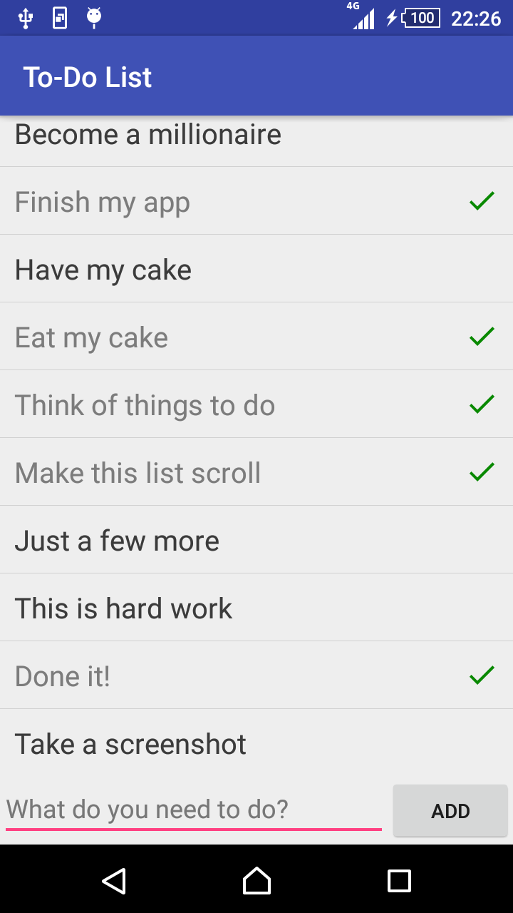
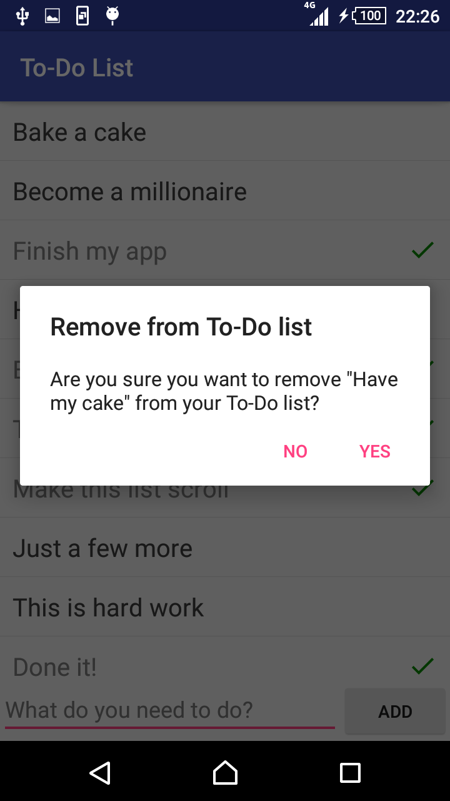

# Native App Studio: To-Do List
By Matthew van Rijn (10779353)

This app allows you add tasks to a todo list.

### Activities
There is only one activity this time which shows the user their todo list. The user can add tasks to the list by selecting the text field at the bottom, entering a task and then pressing either on the add button or on the enter key on their keyboard. By pressing a task it can be checked off, which greys out the text and adds a green tick to the right side of it. To remove a task, completed or not, from the todo list it can be long pressed. This will prompt the user to confirm their choice.

### Screenshots

