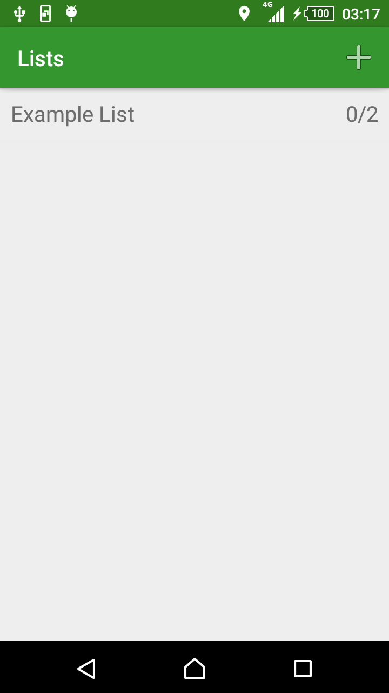
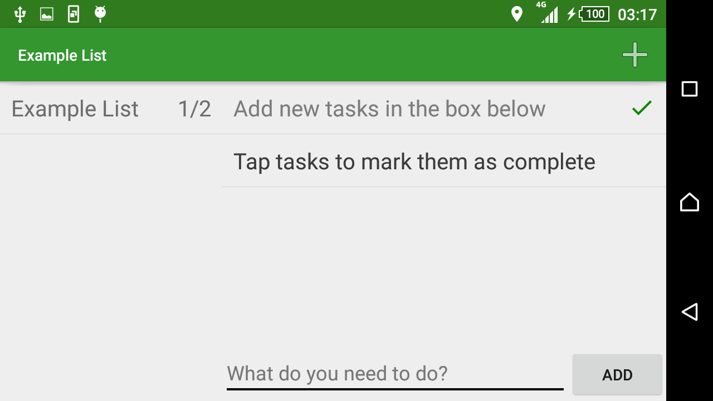
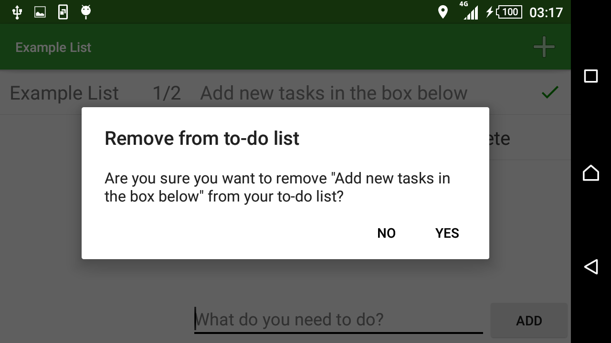

# Native App Studio: Many Lists
By Matthew van Rijn (10779353)

This app allows you add tasks to a collection of todo lists.

### Activities
This app consists of one activity and two fragments. There is a fragment for showing the list of todo lists called MenuFragment and a fragment for showing the tasks in a todo list called ListFragment. When the app is in portrait, the fragments are shown one at a time. When the user selects a todo list on the menu fragment the app will close the menu fragment and open the list fragment. In landscape the fragments are shown side-by-side, so selecting a todo list from the menu fragment will not close the menu fragment but simply update the list fragment. 

### Screenshots

